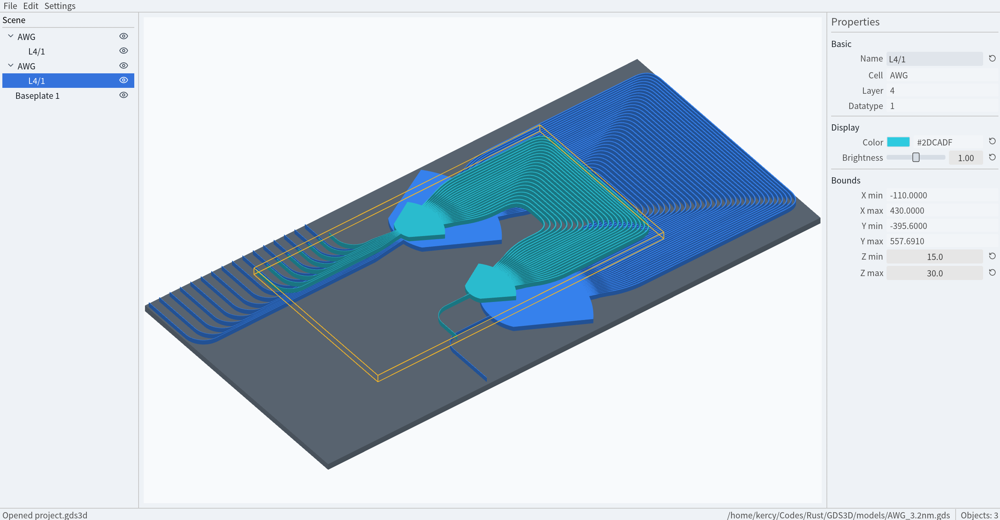

# GDS3D

A 3D visualization editor for GDS layouts built with [egui](https://github.com/emilk/egui).

GDS3D imports GDS files, builds an interactive 3D scene, and exports figures or project files.



## Develop

The project is written by [Rust](https://rust-lang.org).

You need rustup and cargo, then run the project:

```bash
cargo run
```

## License
[MIT](LICENSE)
